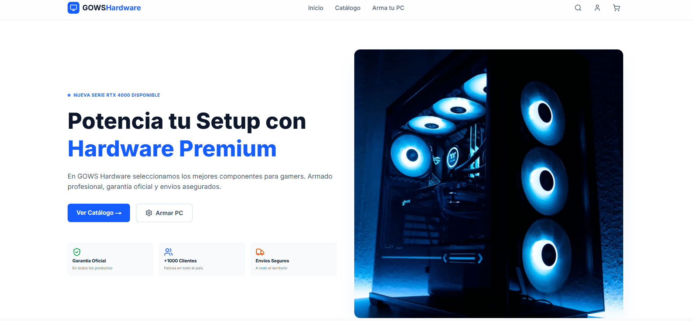

# GOWS Hardware - E-commerce & PC Builder 🚀


<div align="center">
  <br />
  <a href="#" target="_blank">

  </a>
  <br />
  <p><i>Plataforma de E-commerce de Alto Rendimiento con Configurador de PC Interactivo</i></p>
</div>

---

## ⚡ Sobre el Proyecto

**GOWS Hardware** no es solo una tienda online; es una experiencia completa de rendimiento optimizado para entusiastas del hardware. Recientemente refactorizado bajo los estándares más modernos, el núcleo del proyecto es su **Configurador de PC Inteligente**, que guía al usuario paso a paso para armar su equipo ideal, validando compatibilidades y permitiendo exportar presupuestos en PDF con tiempos de carga milimétricos.

## ✨ Características Principales & Optimizaciones Recientes

### 🛠️ Armador de PC (PC Builder)

- **Arquitectura Modular:** Dividido en submódulos (`BuildStepList`, `BuildSummary`, `BuildStepModal`) para garantizar un mantenimiento de código escalable y un _render tree_ liviano en React.
- **Flujo Guiado:** 10 pasos interactivos (CPU, GPU, RAM multislot, etc.) con validación lógica de componentes requeridos.
- **Exportación de Presupuestos (Code Splitting):** Generación automática de presupuestos en PDF. Las librerías de generación (`jspdf`) son importadas **dinámicamente** para reducir de forma masiva el tamaño inicial del _Bundle_ de JavaScript (Performance Score al máximo).

### 🛒 Experiencia de Compra & Rendimiento

- **Carrito Persistente (Zustand SSR Safe):** Estado global persistente en el navegador usando Zustand, con un estricto control de hidratación (Hydration Check) para evitar parpadeos y errores de _mismatch_ en el renderizado del Servidor (SSR) vs el Cliente.
- **Notificaciones Toast:** Feedback visual inmediato e intuitivo impulsado por `sonner` cada vez que se interactúa con el carrito de compras.
- **Búsqueda Debounced:** Barra de búsqueda optimizada con un Custom Hook (`useDebounce`) para evitar sobrecargar el Call Stack al escribir, filtrando los productos de forma eficiente.

### 🌐 UI, SEO y Accesibilidad (A11y)

- **Next.js Dynamic Metadata:** Generación dinámica de `Títulos` y etiquetas `Open Graph` para cada producto individual, maximizando el impacto SEO y la presentación en redes sociales y WhatsApp.
- **Tailwind CSS v4.0:** Estilos modernos impulsados por el nuevo motor de Tailwind, incluyendo keyframes y directivas `@theme` nativas para las animaciones fluidas de interfaz.
- **Accesibilidad Total:** Modales controlables mediante teclado (Cierre mediante tecla `ESC`) y prevención activa del scroll en el cuerpo de la página (_focus traps_).

## 💻 Tecnologías Utilizadas

- **Frontend:** [Next.js 15](https://nextjs.org/) (App Router), [React 19](https://react.dev/).
- **Lenguaje:** [TypeScript](https://www.typescriptlang.org/) (Tipado estricto absoluto).
- **Estilos:** [Tailwind CSS v4](https://tailwindcss.com/) nativo, [Lucide React](https://lucide.dev/) (Iconografía).
- **Estado:** [Zustand](https://github.com/pmndrs/zustand) + Middleware Persist.
- **Utilidades UI:** `sonner` (Toasts), animaciones Keyframes nativas.

## 🚀 Instalación Local

Si quieres correr este proyecto en tu máquina:

1.  **Clonar el repositorio:**

    ```bash
    git clone https://github.com/TU_USUARIO/gowshardware.git
    ```

2.  **Instalar dependencias:**

    ```bash
    npm install
    ```

3.  **Iniciar servidor de desarrollo:**

    ```bash
    npm run dev
    ```

4.  **Ver en el navegador:**
    Abre `http://localhost:3000`.

## 📂 Estructura del Proyecto

```bash
src/
├── app/              # Next.js App Router (Páginas)
│   ├── build/        # Controlador del Armador de PC
│   ├── cart/         # Carrito y Checkout
│   └── products/     # Rutas Dinámicas (SEO Metadata)
├── components/       # Componentes React
│   ├── build/        # Subcomponentes del PC Builder (List, Modal, Summary)
│   ├── layout/       # Navbar SSR-Safe, Footer, Hero
│   ├── products/     # ProductCards interactivos (Toasts)
│   └── ui/           # SearchModal, Botones
├── data/             # Base de datos local (products.ts)
├── hooks/            # Custom Hooks (useDebounce.ts)
├── store/            # Estado Global (Cart Store)
└── types/            # Interfaces TypeScript
```

<div align="center"> Optimizado y Refactorizado con ❤️ para alcanzar el máximo rendimiento </div>
